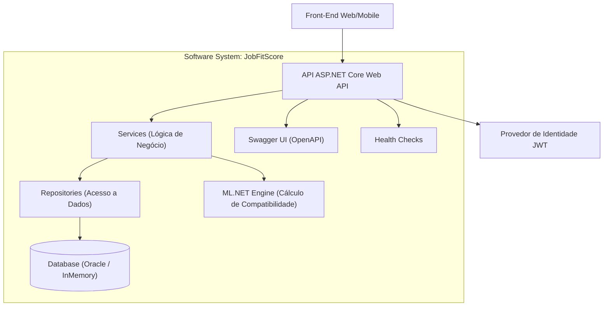
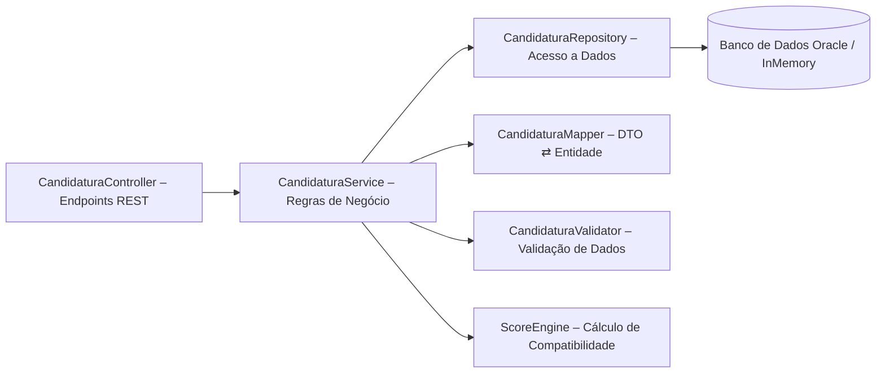

<h1 align="center">
  
  <br><br>
  <b>JobFitScore – Global Solution</b>
</h1>

<p align="center">
  <em>Disciplina:</em> <b>Advanced Business Development with .NET</b><br>
  <em>Professor Orientador:</em> <b>Leonardo Gasparini Romão</b><br>
  <em>Turma:</em> <b>2TDSB</b> — <em>Curso:</em> <b>Tecnologia em Análise e Desenvolvimento de Sistemas – FIAP</b>
</p>

---

### 🧠 Sobre o Projeto

API RESTful desenvolvida em <b>.NET 8</b> para o cálculo de compatibilidade profissional entre candidatos e vagas, 
utilizando análise de habilidades e requisitos com base em técnicas de <b>inteligência computacional</b>.

---

<p align="center">
  
  
  
  
  
  
  
  
</p>


---

## Arquitetura do Sistema

O sistema segue arquitetura em camadas (**Controller → Service → Repository → Data → Model**), garantindo modularidade e manutenibilidade.

### 1. Container Diagram



---

### 2. Component Diagram



---

## Funcionalidades Principais

- CRUD completo para Usuários, Vagas, Candidaturas e Cursos  
- Cálculo de **Score de Compatibilidade** entre perfis e vagas  
- Autenticação JWT e proteção de endpoints  
- HATEOAS em todas as respostas  
- Versionamento de API (v1, v2)  
- Health Check (`/api/health/ping`)  
- Swagger/OpenAPI documentado com anotações  
- Estrutura preparada para **Machine Learning com ML.NET**

---

## Cálculo de Compatibilidade

O **JobFitScore** utiliza lógica ponderada (e futura integração com ML.NET) para calcular o **percentual de compatibilidade** entre candidatos e vagas.

### 📊 Exemplo de Avaliação de Match

| Parâmetro | Descrição | Peso (%) |
|-----------|-----------|----------|
| **Habilidades Técnicas** | Comparação direta entre habilidades e requisitos | 40% |
| **Experiência Profissional** | Tempo e área de atuação | 30% |
| **Formação Acadêmica** | Grau de formação compatível com o cargo | 20% |
| **Cursos Recomendados** | Cursos adicionais que elevam o score | 10% |

---

### 🔍 Exemplo de Resultado do Score

```json
{
  "usuario": "Léo Mota Lima",
  "vaga": "Desenvolvedor .NET Pleno",
  "score": 84,
  "recomendacoes": [
    "Aprender fundamentos de Azure DevOps",
    "Completar curso de Entity Framework Core"
  ]
}
```

**Resultado esperado:** Score alto com sugestões de cursos para aprimorar o perfil profissional.

---

### 🎯 Endpoint de Cálculo de Score

**Método:** `POST`  
**URL:** `/api/v1/candidaturas/calcular-score`

**Corpo da requisição:**
```json
{
  "idUsuario": 1,
  "idVaga": 2
}
```

**Resposta de sucesso (200 OK):**
```json
{
  "success": true,
  "message": "Score de compatibilidade calculado com sucesso",
  "data": {
    "usuario": "João Gabriel Boaventura",
    "vaga": "Analista de Sistemas",
    "score": 76,
    "recomendacoes": [
      "Aprender Docker e containers",
      "Fazer curso avançado de C#"
    ]
  },
  "statusCode": 200,
  "timestampUtc": "2025-11-10T14:30:00Z"
}
```

---

## Tecnologias Utilizadas

| Tecnologia | Descrição |
|-------------|------------|
| **.NET 8 / ASP.NET Core** | Framework principal da API |
| **Entity Framework Core** | ORM para Oracle e InMemory |
| **Swagger / Swashbuckle** | Documentação interativa da API |
| **JWT Bearer** | Autenticação e segurança |
| **xUnit** | Testes de unidade e integração |
| **HATEOAS** | Navegação via links semânticos |
| **Oracle / InMemory** | Suporte a múltiplos bancos de dados |

---

## Pré-requisitos

Antes de executar o projeto, certifique-se de ter instalado:

- [.NET 8 SDK](https://dotnet.microsoft.com/download/dotnet/8.0)
- [Oracle Database](https://www.oracle.com/database/technologies/oracle-database-software-downloads.html)
- [Oracle SQL Developer para VSCode](https://marketplace.visualstudio.com/items?itemName=Oracle.sql-developer)

---

## Execução Local

### 1️⃣ Clonar o repositório

```bash
git clone https://github.com/leomotalima/GS-JobFitScore-AdvancedBusiness.git
cd GS-JobFitScore-AdvancedBusiness
```
---

### 2️⃣ Configurar as credenciais do banco de dados

Crie um arquivo .env na raiz do projeto e configure as credenciais do Oracle:

```env
ORACLE_USER_ID=<Seu Username Oracle>
ORACLE_PASSWORD=<Sua Senha Oracle>
ORACLE_DATA_SOURCE=host:porta/nome_do_serviço
ConnectionStrings__OracleConnection=User Id=${ORACLE_USER_ID};Password=${ORACLE_PASSWORD};Data Source=${ORACLE_DATA_SOURCE}
```

> **⚠️ IMPORTANTE:** Altere os valores de `ORACLE_USER_ID`, `ORACLE_PASSWORD` e `ORACLE_DATA_SOURCE` conforme seu ambiente Oracle local.

---

### 3️⃣ Instalar ferramentas e dependências

Execute os seguintes comandos no terminal:

```bash
# Instalar Entity Framework CLI globalmente (se ainda não tiver)
dotnet tool install --global dotnet-ef

# Restaurar pacotes NuGet
dotnet restore

# Compilar o projeto
dotnet build

# Aplicar migrations no banco de dados
dotnet ef database update

---

### 4️⃣ Executar a aplicação

Volte para a raiz do projeto (se estiver na pasta Scripts):

```bash
cd ..
```

Execute a aplicação:

```bash
dotnet run
```

A API estará disponível em: **[http://localhost:5224/swagger/index.html](http://localhost:5224/swagger/index.html)**

---

## Estrutura do Projeto

```
JobFitScore/
├── Controllers/           # Endpoints da API
├── Data/                 # DbContext e configurações EF
├── DTOs/                 # Data Transfer Objects
├── Hateoas/              # Implementação HATEOAS
├── Models/               # Entidades do domínio
├── Repositories/         # Acesso a dados
├── Services/             # Lógica de negócio
├── Swagger/              # Configurações Swagger
├── Scripts/              # Scripts SQL (inserts.sql)
├── JobFitScore.Tests/    # Testes automatizados
├── Program.cs            # Ponto de entrada da aplicação
├── .env                  # Variáveis de ambiente (criar manualmente)
└── README.md
```

---

## Health Check
```http
GET /api/health/ping
```
**Resposta:**
```json
{
  "success": true,
  "message": "API rodando com sucesso 🚀",
  "data": {
    "status": "Healthy",
    "version": "1.0.0",
    "uptime": "00:00:00",
    "environment": "Development",
    "host": "<nome do host>",
    "timestampUtc": "2025-11-10T12:50:01.517Z"
  },
  "statusCode": 200,
  "timestampUtc": "2025-11-10T12:50:01.517Z"
}
```

---

## Equipe de Desenvolvimento

<table align="center">
<tr>
<td align="center">
<a href="https://github.com/thejaobiell">
<br>
<sub><b>João Gabriel Boaventura</b></sub><br>
<sub>RM554874 • 2TDSB2025</sub><br>
</a>
</td>
<td align="center">
<a href="https://github.com/leomotalima">
<br>
<sub><b>Léo Mota Lima</b></sub><br>
<sub>RM557851 • 2TDSB2025</sub><br>
</a>
</td>
<td align="center">
<a href="https://github.com/LucasLDC">
<br>
<sub><b>Lucas Leal das Chagas</b></sub><br>
<sub>RM551124 • 2TDSB2025</sub><br>
</a>
</td>
</tr>
</table>

---

## Licença

Distribuído sob a licença **MIT**.  
Consulte [LICENSE](https://choosealicense.com/licenses/mit/).
